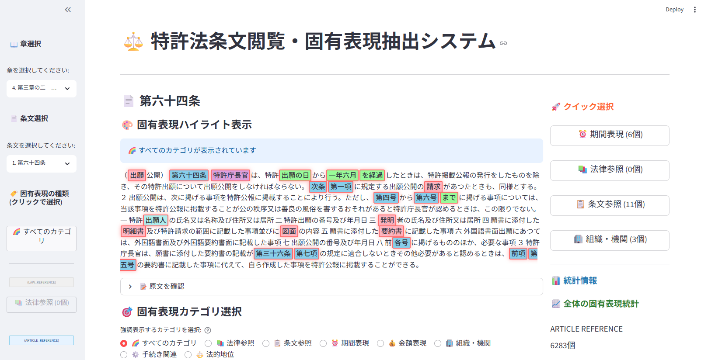
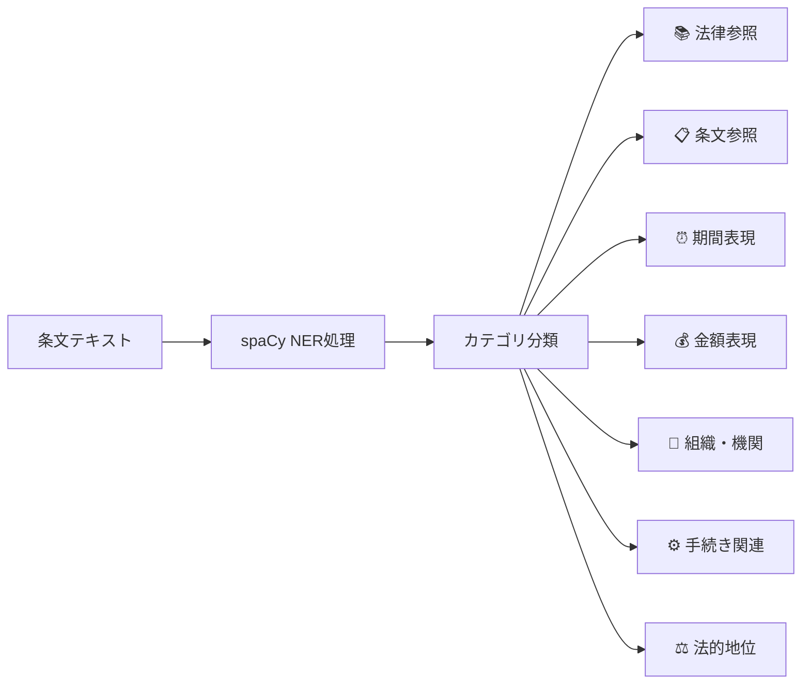
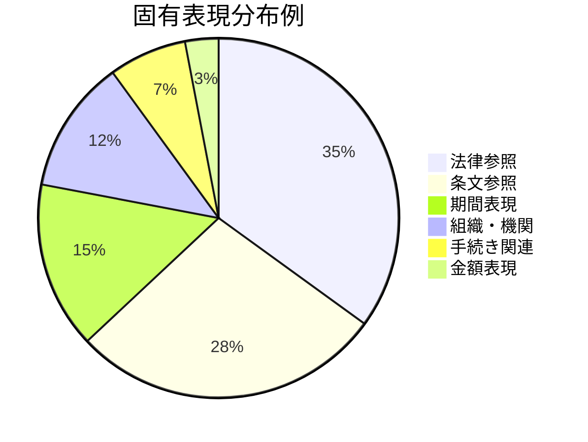
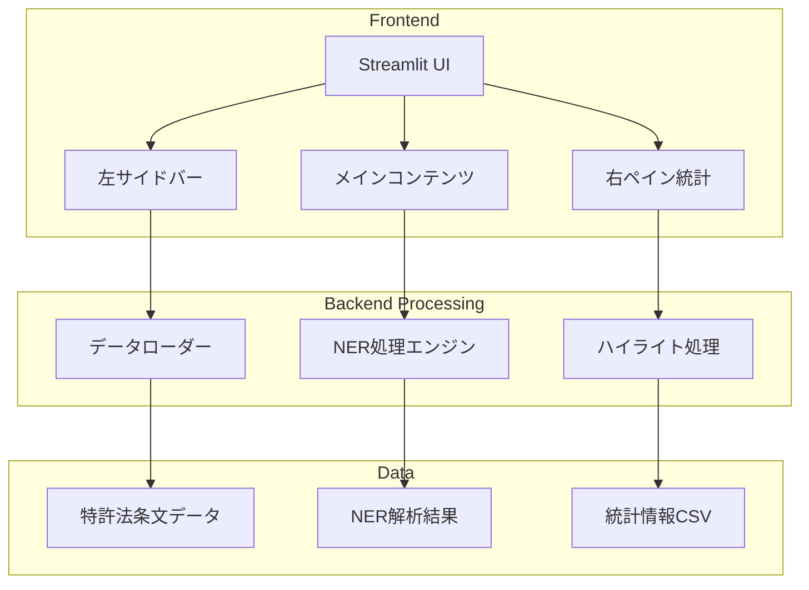
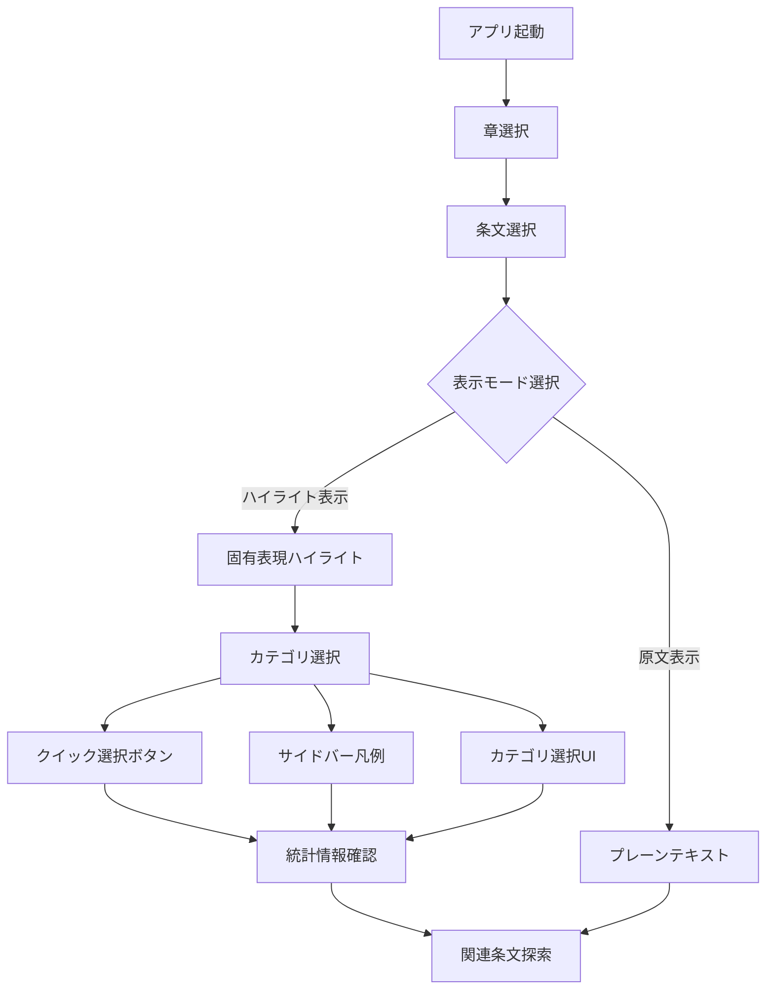
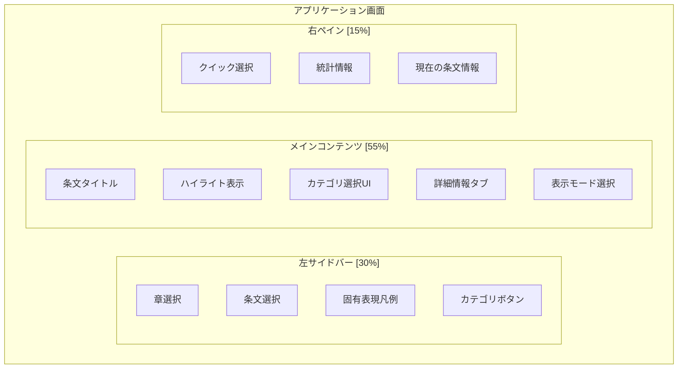
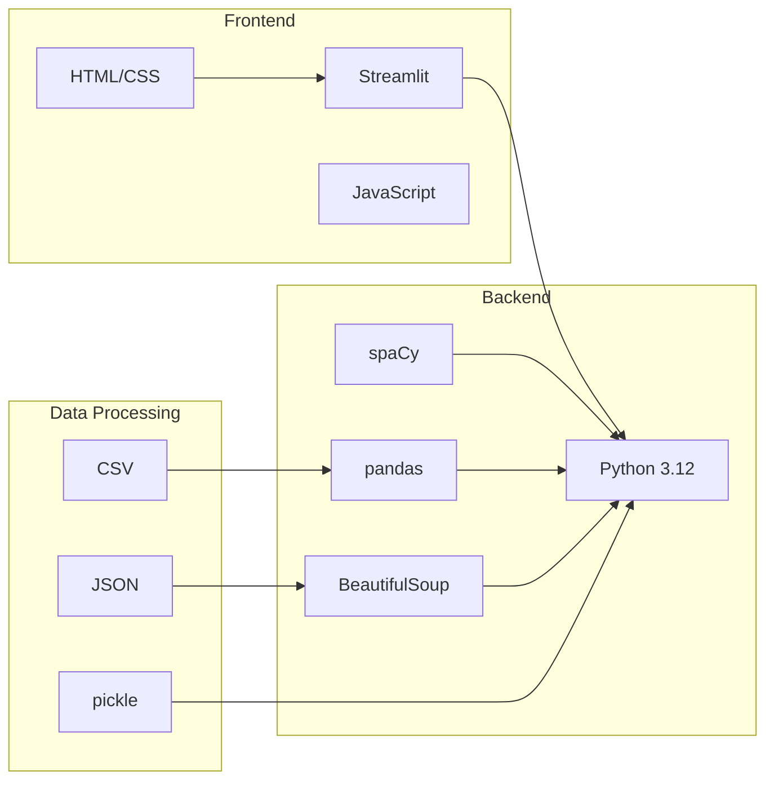
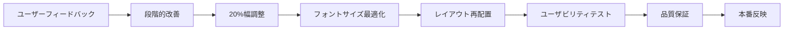
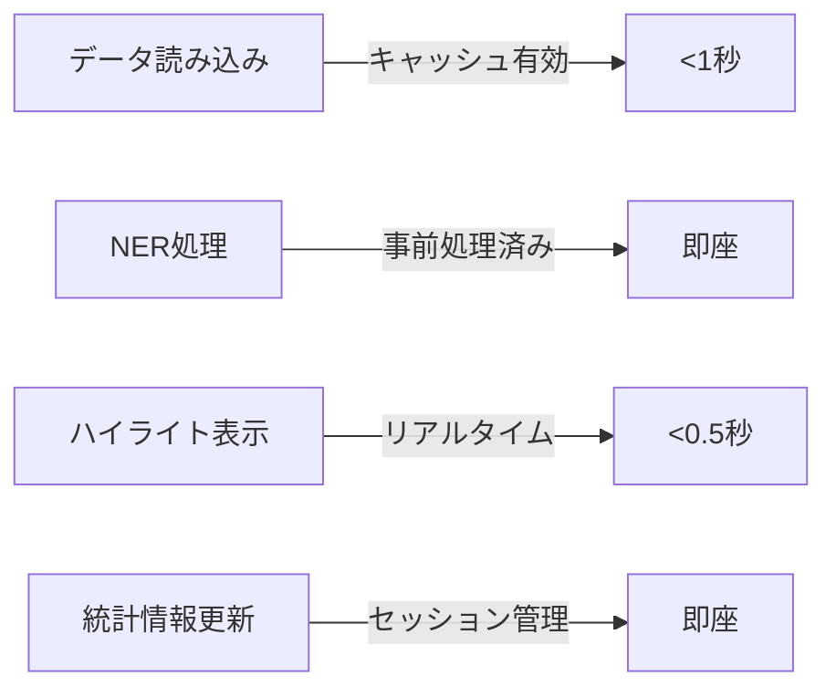
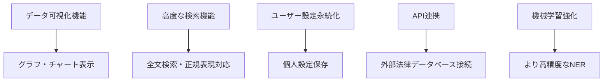

# ⚖️ 特許法条文閲覧・固有表現抽出システム



## 📖 概要

日本の特許法条文を閲覧し、固有表現認識（NER: Named Entity Recognition）により法律用語や重要な表現を自動的に抽出・ハイライト表示するStreamlitアプリケーションです。法律の理解を深め、条文間の関連性を視覚的に把握することができます。

## ✨ 主な機能

### 🎯 固有表現認識（NER）


### 🎨 ハイライト表示機能
- **カテゴリ別色分け**: 固有表現の種類ごとに異なる色でハイライト
- **選択的強調**: 特定のカテゴリのみを強調表示
- **インタラクティブ選択**: クリック操作による直感的なカテゴリ選択

### 📊 統計情報表示


### 🔍 検索・フィルタリング機能
- **章別検索**: 特許法の章ごとの条文閲覧
- **条文検索**: 特定の条文へのダイレクトアクセス
- **固有表現検索**: キーワードによる固有表現検索

## 🏗️ システム構成



## 🚀 使用方法

### 1. 環境構築

```bash
# リポジトリのクローン
git clone <repository-url>
cd article0121-2023-1202-251004

# 依存関係のインストール
pip install -r requirements.txt
# または
uv sync
```

### 2. アプリケーション起動

```bash
streamlit run app_with_ner.py
```

### 3. 基本操作フロー



## 🎛️ UI構成

### レイアウト設計


### カラーパレット


## 📁 プロジェクト構造

```
article0121-2023-1202-251004/
├── app_with_ner.py                 # メインアプリケーション
├── ner_extractor.py               # NER処理モジュール
├── main.py                        # 補助スクリプト
├── pyproject.toml                 # プロジェクト設定
├── uv.lock                        # 依存関係ロック
├── README.md                      # このファイル
├── images/                        # スクリーンショット
│   └── app-screenshot.png
├── work_log/                      # 作業ログ
│   ├── work_log_2025-1004-2148.md
│   └── work_log_2025-1004-2152.md
├── for-debug/                     # デバッグファイル
└── __pycache__/                   # キャッシュファイル
```

## 📊 データファイル

| ファイル名 | 説明 |
|------------|------|
| `*.pickle` | 特許法条文データ（複数バージョン） |
| `*.csv` | NER解析結果統計 |
| `*.html` | 元データ（HTML形式） |
| `*.json` | 構造化データ |

## 🔧 技術スタック



## 🎨 最近のUI改善

### 実装された改善項目
- ✅ **右ペイン幅調整**: カラム比率を20%ずつ段階的に最適化
- ✅ **フォントサイズ統一**: 右ペイン全体のフォントサイズを2倍に拡大
- ✅ **表示モード選択の移動**: 最下部に配置して操作性向上
- ✅ **クイック選択ボタン**: 右ペインに移動・縦並び配置
- ✅ **コンポーネント順序最適化**: 直感的なユーザーフローを実現
- ✅ **統計情報表示の強化**: HTMLマークダウンによる見出し制御

### UI改善フロー


## 🚦 開発・テスト状況

### 品質保証項目
- ✅ 右ペインの幅調整動作確認
- ✅ フォントサイズ変更の視覚確認  
- ✅ クイック選択ボタンの動作確認
- ✅ 表示モード切り替えの動作確認
- ✅ セッション状態の保持確認

### 既知の制限事項
- **クイック選択ボタンのフォントサイズ**: Streamlitの制約により完全統一に限界
- **レスポンシブデザイン**: 固定カラム比率による制約（デスクトップ最適化済み）

## 📈 パフォーマンス指標

### 処理性能


### メモリ使用量
- **データサイズ**: 約10-50MB（条文データ）
- **NER結果**: 約5-20MB（解析済みデータ）
- **UI状態**: 約1-5MB（セッション状態）

## 🔮 今後の改善計画

### 短期的改善（1週間以内）
- [ ] クイック選択ボタンの更なるスタイル調整
- [ ] 統計情報の表示内容拡充
- [ ] エラーハンドリングの強化

### 中期的改善（1ヶ月以内）
- [ ] レスポンシブデザインの実装
- [ ] テーマ切り替え機能（ダーク/ライトモード）
- [ ] パフォーマンス最適化

### 長期的改善（3ヶ月以内）


## 🤝 貢献方法

1. このリポジトリをフォーク
2. 機能ブランチを作成 (`git checkout -b feature/AmazingFeature`)
3. 変更をコミット (`git commit -m 'Add some AmazingFeature'`)
4. ブランチにプッシュ (`git push origin feature/AmazingFeature`)
5. プルリクエストを作成

## 📝 ライセンス

このプロジェクトはMITライセンスの下で公開されています。詳細は`LICENSE`ファイルを参照してください。

## 📞 お問い合わせ

プロジェクトに関するご質問やフィードバックがございましたら、Issueを作成してください。

---

**Built with ❤️ by GitHub Copilot | Powered by Streamlit & spaCy**
